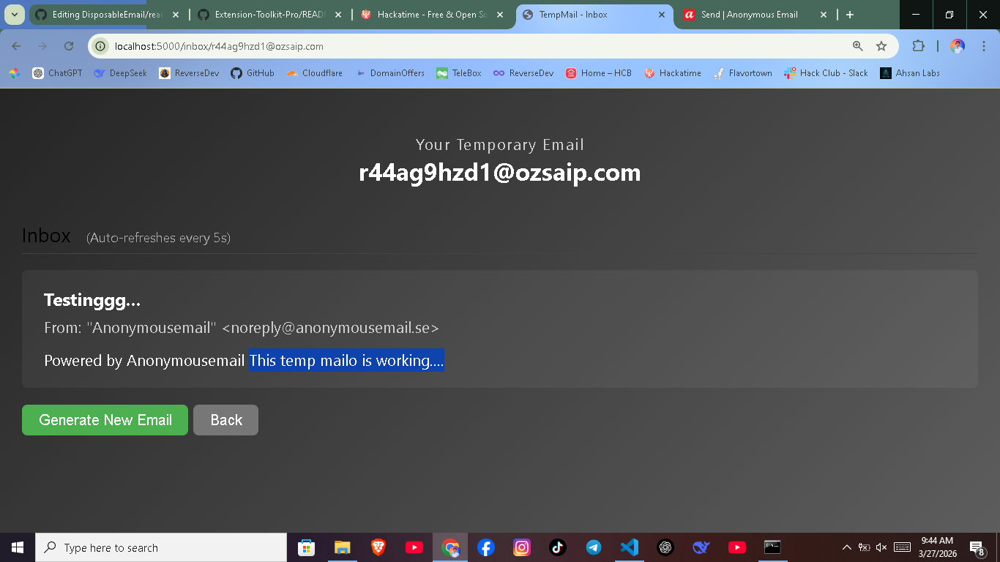

# DISPOSABLE EMAIL
 Get temporary email for free fo signing up into insecure & strange websites. Its mainly built for security purpose and to prevent user fro using personal email in strange sites.

 ## Demo Video
 [Watch the Demo](https://youtu.be/XxNqEcPN3QE)

 
## Key Features
* Direct deployment - easy to deploy on vercel ( one time setup )
* Instant Email generation - Just click on generate email & your temporary email is ready.
* Auto refresh - Automatically refreshes inbox messages.
* Clean & Basic UI: Modern, responsive & professional design that works on your desktop perfectly.

  
## How to Run:
1. Download the release or Clone this repository.
   <pre> git clone https://github.com/ReverseMohan/DisposableEmail.git </pre>
2. Navigate to the folder.
   <pre> cd DisposableEmail </pre>
4. Install the requirements.
   <pre> pip install -r requirements.txt </pre> 
5. Run the app
   <pre> python app.py </pre>  

## Note: 
This tool is intended for privacy and testing purposes. Please do not use it for illegal activities.
